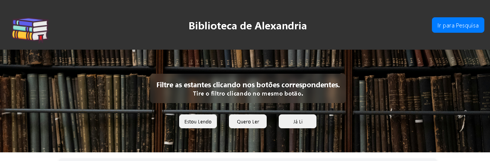
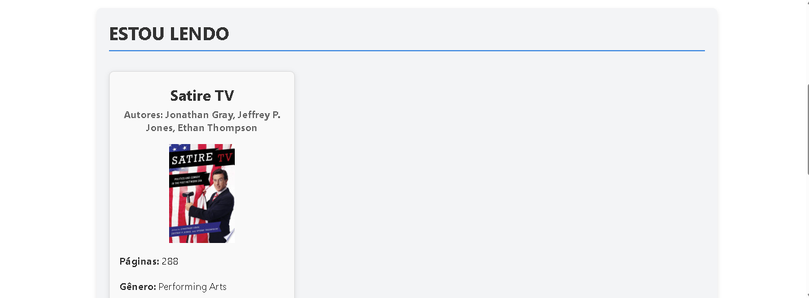
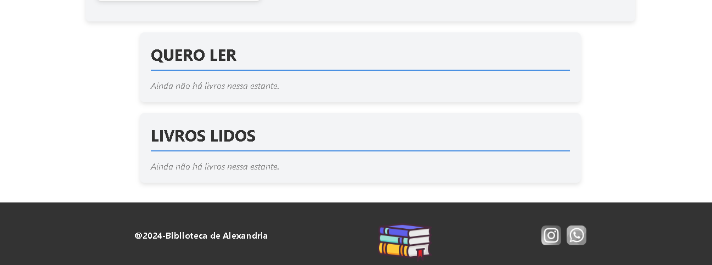
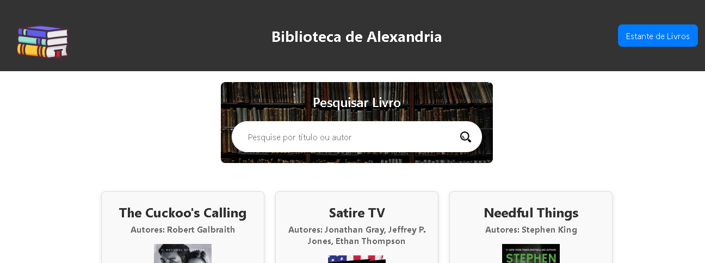
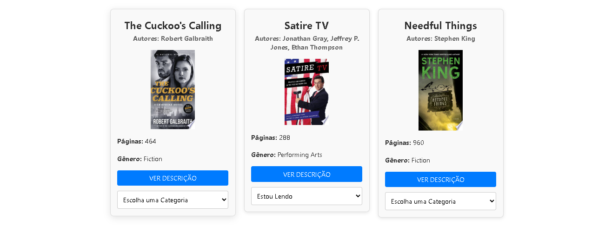

# 📚 Estante de Livros

[🔗 Acesse o projeto no CodeSandbox](https://codesandbox.io/p/sandbox/estante-livros-pqlsms)

Este é um **projeto acadêmico** desenvolvido em **React**, com o objetivo de permitir ao usuário explorar livros disponíveis por meio de uma **API pública de teste**, categorizá-los e organizá-los em uma estante virtual personalizada.

> ⚠️ Este projeto é apenas para fins educacionais e **não possui backend próprio** ou vínculo com uma API oficial de livros.

---

## 🎯 Objetivo do Projeto

- Explorar e consumir dados de uma API REST  
- Permitir categorização personalizada de livros (Lido, Estou Lendo, Tenho Interesse)  
- Praticar o uso do **React**, **useState**, **useEffect** e **Context API**  
- Persistir dados localmente com **localStorage** para manter os livros mesmo após recarregar a página  

---

## 🛠️ Tecnologias Utilizadas

- **React.js**
- **JavaScript (ES6+)**
- **HTML5 e CSS3**
- **Context API**
- **LocalStorage**
- **CodeSandbox** (ambiente de desenvolvimento e deploy)

---

## 📄 Funcionalidades da Aplicação

| Funcionalidade | Descrição |
|----------------|-----------|
| 🔍 Pesquisa de Livros | Acesse a página de pesquisa e visualize os livros fornecidos pela API, com capa, título, autor e descrição. |
| 📌 Categorização | Marque livros como **Lido**, **Estou Lendo** ou **Tenho Interesse**. |
| 📚 Estante Pessoal | Veja os livros adicionados organizados por categoria. |
| 🔄 Atualização de Categoria | Altere a categoria de um livro mesmo após ele estar na estante. |
| 💾 Persistência Local | Os dados ficam salvos no navegador, mesmo após atualizar a página (F5). |

---

## 🖼️ Prints da Aplicação

### 📚 Cabeçalho da Estante


### 🔍📚 Categoria da Estante com Livro


### 📑📚 Categoria da Estante sem Livros


### 🔍 Cabeçalho da Tela de Pesquisa


### 📦 Cards dos Livros com Foto, Título, Autor(a/es/as), Descrição e Botão de Categorização


---

## 📁 Estrutura do Projeto

```plaintext
📁 src
├── 📂 components          # Componentes reutilizáveis e seus arquivos CSS
├── 📂 contexts            # Contexto global (BookContext.js)
├── 📂 img                 # Imagens utilizadas no projeto
├── 📂 pages               # Páginas principais da aplicação
│   ├── MainPage.js
│   ├── SearchPage.js
│   └── 📂 pagesCSS        # Estilos específicos das páginas
├── 📂 service             # Lógica para comunicação com a API
│   └── bookService.js
├── App.js                 # Componente raiz da aplicação
├── index.js               # Ponto de entrada da aplicação
└── styles.css             # Estilo global da aplicação

📄 package.json            # Dependências e scripts do projeto
```
---

## ✨ Destaques Técnicos

- Uso de **Context API** para compartilhamento de estado entre páginas  
- Integração com **API pública** para listagem de livros  
- Componente de **seleção dinâmica de categorias**  
- Interface simples e organizada, com foco em usabilidade  

---

## 📚 Contexto Acadêmico

Este projeto foi desenvolvido como parte das atividades práticas da disciplina de **Programação Web com React** no curso de **Ciência da Computação**.  
O foco é treinar a construção de aplicações com React e entender como manipular dados externos e estados globais.

---

## 👨‍💻 Desenvolvedor

**Kevin Thiago**  
Estudante de Ciência da Computação – 5º período  

---

## ✅ Como testar ou adaptar

Se quiser testar, adaptar ou usar como base para estudos:

1. Acesse o projeto diretamente no CodeSandbox:  
   [https://codesandbox.io/p/sandbox/estante-livros-pqlsms](https://codesandbox.io/p/sandbox/estante-livros-pqlsms)

2. Explore, edite e salve suas próprias versões clicando em **"Fork"** dentro do CodeSandbox.
